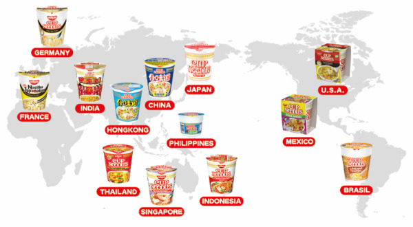

```{r setup, include=FALSE}
library(tidyverse)
library(ggridges)
library(plotly)
```

```{r, include=FALSE}
tidy_ramen = 
  read_csv("./ramen-ratings.csv") %>% 
  janitor::clean_names() %>% 
  separate(top_ten, into = c("year", "rank"), sep = " #", convert = TRUE) %>% 
  mutate(
    country = str_replace(country, "Hong Kong", "China"),
    country = str_replace(country, "Taiwan", "China"),
    style = factor(style),
    country = factor(country),
    brand = factor(brand),
    stars = as.numeric(stars)
  )
```

<center></center>  

## Background Introduction 
There are `r tidy_ramen %>% distinct(country) %>% summarize(count = n())` countries included in our Ramen dataset. 


## Top Ramen Produce Countries
```{r, echo=FALSE, message=FALSE}
top10_country = 
  tidy_ramen %>%
  count(country) %>%
  mutate(
    country = fct_reorder(country, n),
    country_rank = min_rank(desc(n))
  ) %>%
  filter(country_rank <= 10) %>% 
  ggplot(aes(x = country, y = n, fill = country)) +
    geom_col() +
    geom_text(
      aes(label = n),
      nudge_y = 10
    ) +
    labs(
      title = "Top 10 ramen produce countries",
      y = "Number of ramen varieties",
      x = "Country"
    ) +
    theme(legend.position = "none", axis.text.x = element_text(angle = 30))

top10_country
```

The top four countries that had the most ramen varieties rated are China (n = 530), Japan (n = 352), USA (n = 323) and South Korea (n = 309), with over 300 varieties of ramen recorded! The count of ramen varieties produced by China far outweighs the ramen varieties in other countries.

## Rating Distribution among Top Four Ramen Produce Countries
Now let's take a closer look at the rating distribution among the top four ramen produce countries!
```{r, echo=FALSE, message=FALSE}
tidy_ramen_top4 = 
  tidy_ramen %>%
  filter(country == c("China", "Japan", "USA", "South Korea")) %>%
  drop_na(stars) %>%
  ggplot(aes(x = stars, y = country, fill = country)) + 
  geom_density_ridges(scale = .85) +
  labs(
    title = "Ramen rating distribution among Japan, USA, and South Korea",
    x = "Stars (0-5)",
    y = "Country"
  )

tidy_ramen_top4
```

According to the graph, it appears that most ramens produced by China, South Korea, and USA have a peak of rating scores around 4 stars and a second but smaller peak at score 5. Among all four countries, Japan has relatively higher rating scores with more rating scores at score around 4 to 5 stars.  

## Average Rating by Country
What are the top/bottom countries that have the highest/lowest average rating scores on their ramens? Do you have any guess?

<center></center>

But before we go ahead, let's first plot a scatter plot of average stars vs. number of varieties rated for each country.

```{r, echo=FALSE, message=FALSE}
num_var_country = 
  tidy_ramen %>% 
  count(country)

avg_country = 
  tidy_ramen %>% 
  group_by(country) %>% 
  summarize(avg = round(mean(stars, na.rm = TRUE), 2))

avg_num_country = 
  num_var_country %>% 
  inner_join(avg_country, by = "country")

scatter_avg_num = 
  avg_num_country %>% 
  ggplot(aes(x = n, y = avg)) +
    geom_point(color = "Orange") +
    labs(
      x = "Number of varieties rated",
      y = "Average stars",
      title = "Average stars vs. Number of varieties rated for countries"
    )

scatter_avg_num
```

From the scatter plot, we can see that the average stars for countries with fewer varieties rated are more diverse and include more extreme values, while those for countries with more varieties rated are more concentrated around or within 3.5 to 4.0.  

Since we believe that we need enough sample size for a meaningful average rating, we'll focus on countries with 30 or more varieties rated in the following analysis.  

Here is the result!  
(NOTE: Check out the average rating score for each country by moving your mouse over each bar)
```{r, echo=FALSE, message=FALSE, warning=FALSE}
avg_country_bar = 
  avg_num_country %>%
  filter(n >= 30) %>% 
  mutate(
    country = fct_reorder(country, avg),
    text_label = str_c("Country: ", country, "\nAverage Stars: ", avg)
  ) %>%
  plot_ly(x = ~country, y = ~avg, color = ~country, type = "bar", text = ~text_label) %>% 
  layout(
    title = "Average stars for each country with 30 or more varieties rated",
    xaxis = list(title = "Country"),
    yaxis = list(title = "Average stars")
  )

avg_country_bar
```

Does the result differ from your expectation? Among countries with 30 or more varieties rated, it appears that the top 3 average rating countries have average rating scores around 4.1 out of 5 stars. Malaysia had the highest average rating score (`r avg_num_country %>% filter(country == "Malaysia") %>% pull(avg)` out of 5) among all countries, followed by Singapore (`r avg_num_country %>% filter(country == "Singapore") %>% pull(avg)` out of 5) and Indonesia (`r avg_num_country %>% filter(country == "Indonesia") %>% pull(avg)` out of 5). These countries produced ramens with higher quality (better taste) despite that they were not the top ramen producers in varieties.  
On the contrary, bottom 3 average rating countries are Canada (`r avg_num_country %>% filter(country == "Canada") %>% pull(avg)` out of 5), UK (`r avg_num_country %>% filter(country == "UK") %>% pull(avg)` out of 5), and Vietnam (`r avg_num_country %>% filter(country == "Vietnam") %>% pull(avg)` out of 5).